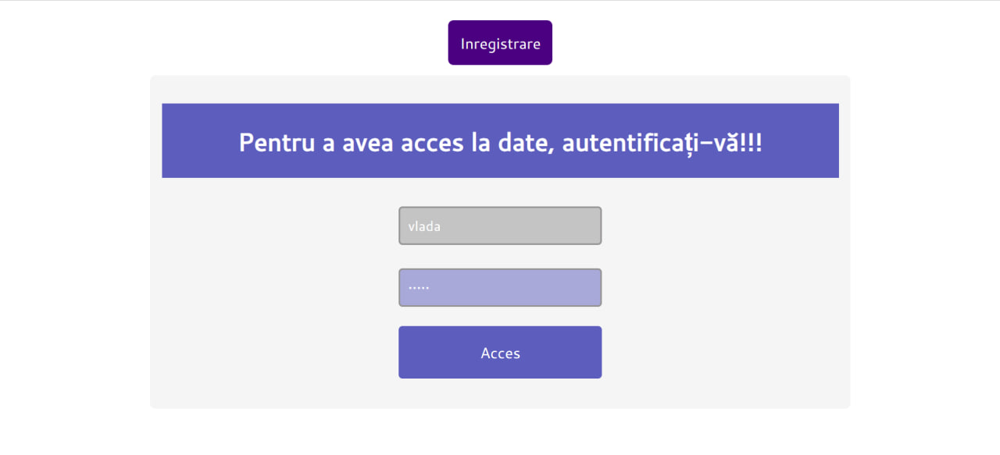
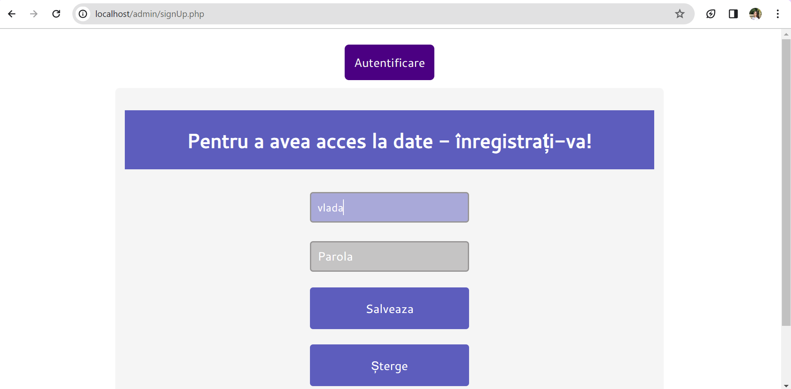
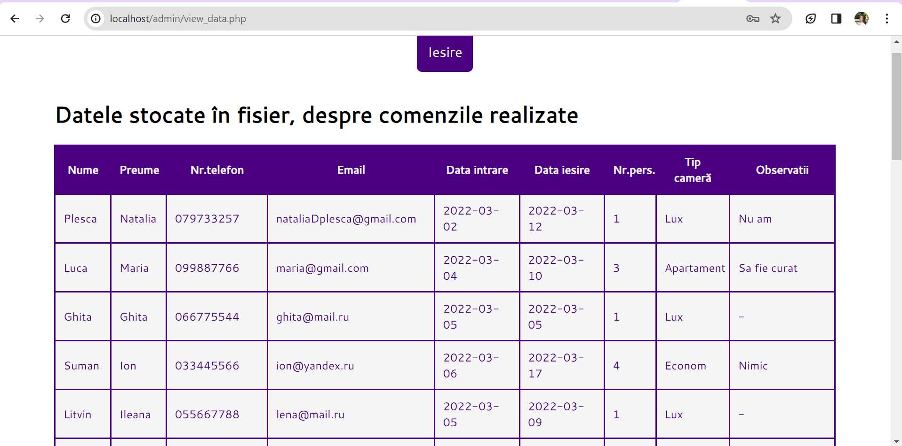

# Лабораторная №7 (Сессии и переменные типа сессии)
## Описание лабораторной работы.
Этот проект иллюстрирует функционирование сессий и их переменных. Его цель - работа с механизмом сессий и их переменными, которые хранят информацию о пользователе на сервере в течение определенного периода времени. Сессии позволяют сохранять состояние между запросами клиента, обеспечивая непрерывное взаимодействие пользователя с веб-приложением.
## Краткая документация к проекту и примеры использования кода.
* index.php
```php
	session_start(); 
	require 'config.php';
	if (isset($_REQUEST['ok'])) {
	if ((isset($_POST["login"]))and(!empty($_POST['login']))and(isset($_POST["pass"]))and(!empty($_POST['pass']))) {
		$password=$_POST["pass"];
		$login=$_POST["login"];
		$log=fopen("data/accounts.txt", "r")or die("Nu a fost gasit fisierul!");
		$exist=false;
		while(!feof($log))
		{
		$extras=trim(fgets($log));
		$date_cont = explode(" ", $extras);
		if(($date_cont[0] == $login) and ($date_cont[1]==md5($password))) {$exist=true;}
		}
		fclose($log);
		if ($exist==true){
			$_SESSION['user'] = $login;
			header('Location: http://'.$_SERVER['SERVER_NAME'].$path.'/view_data.php');
		} else {
			header('Location: http://'.$_SERVER['SERVER_NAME'].$path.'/');}		
		}
		}
```
* signUp.php
```php
	session_start(); 
	require 'config.php';
	if ((isset($_POST["login"]))and(!empty($_POST['login']))and(isset($_POST["pass"]))and(!empty($_POST['pass']))) {
		$password=$_POST["pass"];
		$login=$_POST["login"];
		$exist=false;
		if (!file_exists($fileName)) {
			$txt=fopen("$fileName","a") or die("Fisier inaccesibil!");
			$log=$_POST["login"];
			fwrite($txt, $log);
			$spatiu=" ";
			fwrite($txt,$spatiu);
			$password=md5($_POST["pass"]);
			fwrite($txt,$password);
			$enter="\n";
			fwrite($txt,$enter);
			fclose($txt);
			$initial= true;
			$mesaj = "Contul a fost creat!";
		}
		$log=fopen($fileName, "r+")or die("Nu a fost gasit fisierul!");
		while(!feof($log))
		{
			//trim — sterge spatiile si alte simboluri de la inceputul si sfarsitul sirului
			$extras=trim(fgets($log));
			if($extras == $login.' '.md5($password)) {
				$exist=true;
			}
		}
		fclose($log);
		$mesaj = "";
		if ($exist==true){
			$mesaj = "<span class='error'>Un cont cu acest login si parola deja exista!!!<br />Introdu alte date pentru inregistrare!</span>";
		} elseif($initial==true){
			$mesaj = "<span class='error'>Este primul cont creat!</span>";
		} else {
			$txt=fopen("$fileName","a") or die("Fisier inaccesibil!");
			$log=$_POST["login"];
			fwrite($txt, $log);
			$spatiu=" ";
			fwrite($txt,$spatiu);
			$password=md5($_POST["pass"]);
			fwrite($txt,$password);
			$enter="\n";
			fwrite($txt,$enter);
			fclose($txt);
			$mesaj = "<span class='error'>Contul a fost creat!</span>";
		}
	}
```
* view_data.php
```php
  require 'config.php';
    session_start(); 
    if(!$_SESSION['user']) { 
        header('Location: http://'.$_SERVER['SERVER_NAME'].$path.'/');
    }   
```
* logout.php
```php
    require 'config.php';
    session_start();
    session_destroy();

    header('Location: http://'.$_SERVER['SERVER_NAME'].$path.'/');
```
## Примеры использования
1. index.php

2. signup.php

3. view_data.php

## Вывод 
В результате выполнения лабораторной работы было реализовано использование сессий и переменных типа сессии в мини-веб приложении. Это позволило правильно организовать процессы входа и выхода пользователей, обеспечивая сохранение их состояния между запросами. Анализ предоставленного примера из архива позволил более глубоко понять принципы работы сессий и корректно применить их в разработке веб-приложений.